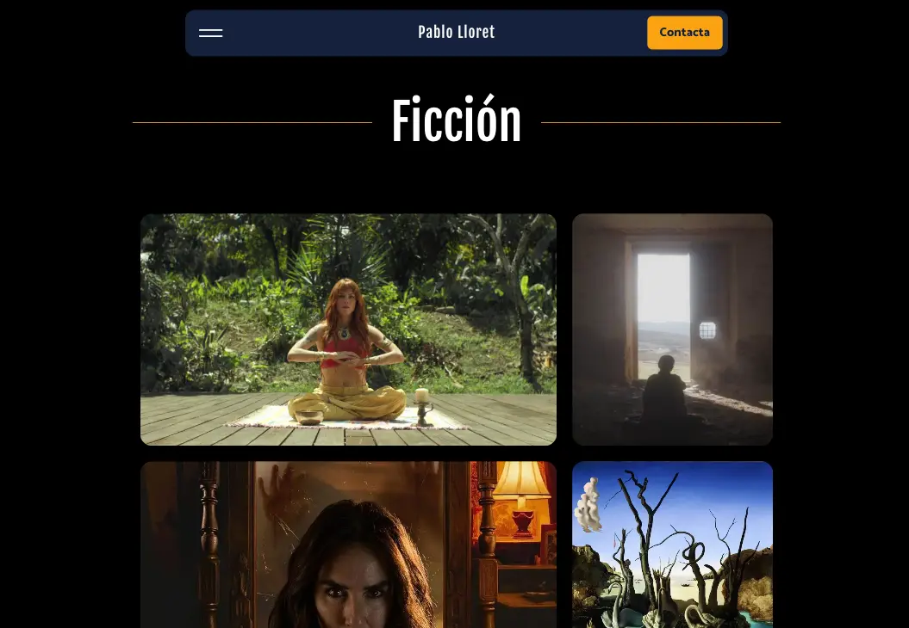
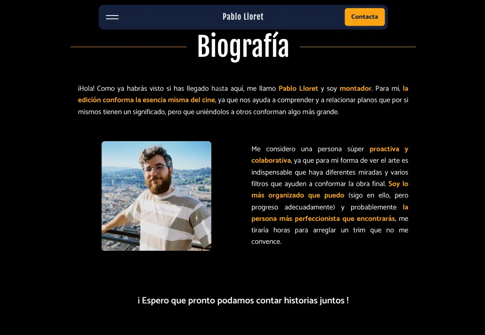
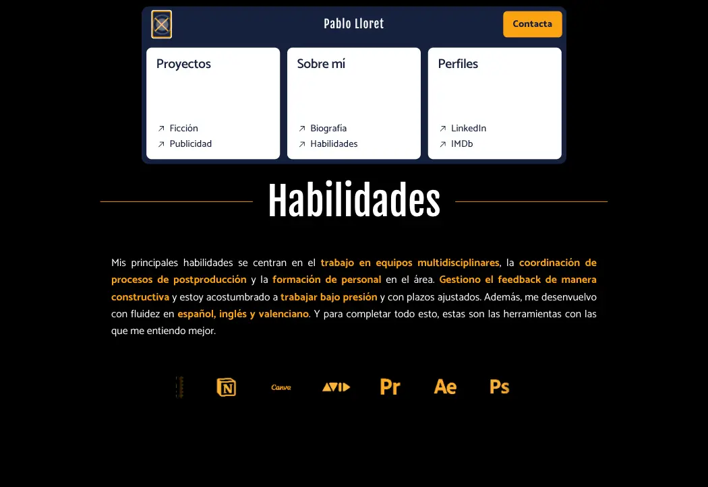
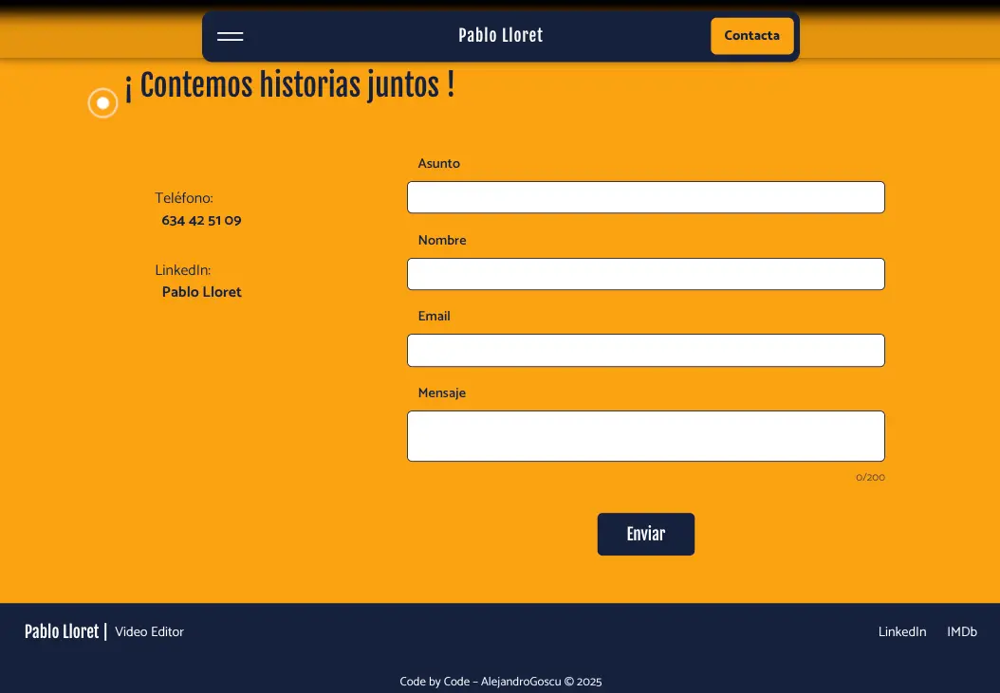

# Pablo Lloret Portfolio

A modern, full-stack portfolio website for Pablo Lloret, a professional video editor. This project showcases his fiction and advertising work, biography, skills, and includes a secure admin dashboard for dynamic content management. Built with React, Node.js, and MongoDB, the site features engaging UI/UX, responsive design, and a contact form with email notifications.

---

 

[]()
[]()
[]()

---

## 🚀 Live Demo

[🔗 View Portfolio Online](https://pablolloret.onrender.com) 

---

## Demo Screenshots

<p align="center">
  
  
  
  
</p>

---

## Features

- **Manage portfolio content dynamically with a secure admin dashboard**
- **Engaging UI/UX with animations, responsive layout, and accessibility in mind**
- **Showcase fiction and advertising projects with rich media**
- **Contact form with email notifications**
- **Role-based authentication for admin access**

---

## Architecture

The project uses a classic MERN stack:

```
[Frontend (React)]
        |
   REST API
        |
[Backend (Express)]
        |
   MongoDB Driver
        |
   [MongoDB]

[Frontend] -- Email API --> [Nodemailer]
```

- **Frontend:** React + Vite, communicates with backend via REST API.
- **Backend:** Node.js + Express, handles authentication, CRUD, and email.
- **Database:** MongoDB stores projects and admin data.
- **Email:** Nodemailer sends contact form submissions.

---

## Quick Start

```sh
git clone https://github.com/yourusername/pablo-lloret-portfolio.git
cd pablo-lloret-portfolio
npm install
npm run dev
```
> Both frontend and backend start in development mode. See below for advanced setup.

---

## Installation (Advanced)

### Backend

```sh
cd backend
pnpm install
cp .env.example .env # Fill in your secrets
node seedAds.js
node seedFictions.js
node server.js
```

### Frontend

```sh
cd frontend
pnpm install
cp .env.example .env # Fill in your secrets
pnpm run dev
```

---

## Environment Variables

| Variable         | Location   | Description                       |
|------------------|------------|-----------------------------------|
| MONGODB_URI      | backend    | MongoDB connection string         |
| JWT_SECRET       | backend    | JWT authentication secret         |
| FRONTEND_URL     | backend    | Allowed CORS origin               |
| VITE_API_URL     | frontend   | Backend API base URL              |
| GMAIL_USER       | frontend   | Gmail address for contact form    |
| GMAIL_PASS       | frontend   | Gmail app password                |

---

## Contributing

1. **Fork** the repo
2. **Clone** your fork
3. **Create a branch** (`git checkout -b feature/your-feature`)
4. **Commit & push** your changes
5. **Open a Pull Request**

---

## Testing

- (Add instructions here if you have unit or integration tests)
- Example: `npm test` or `pnpm test` in backend/frontend

---

## Roadmap / Future Improvements

- Add multi-language support
- Improve accessibility (a11y)
- Add video previews for projects
- Expand admin dashboard features

---

## License

MIT

---

**Developed & Maintained by Alejandro Goscu for Pablo Lloret’s portfolio.**
